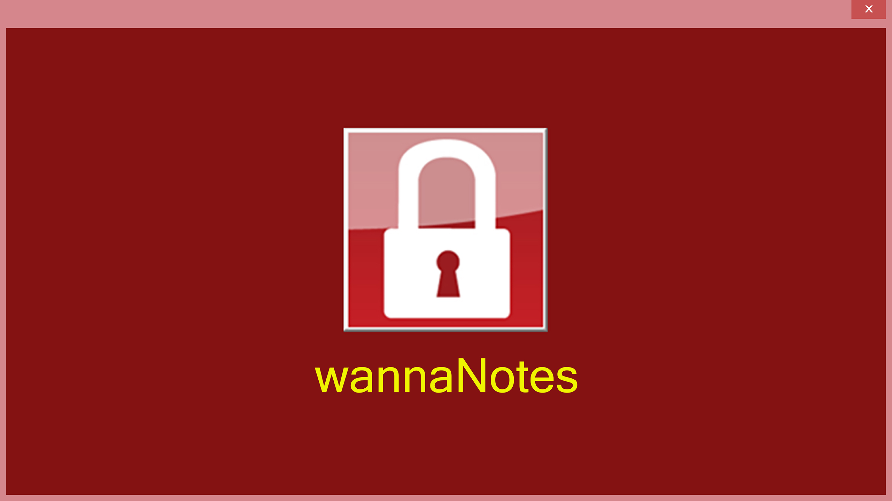

# wannaNotes
A comprehensive compilation of my ``personal cybersecurity knowledge``. <br>
I like information to be <u>accessible and useful</u>, so I hope **wannaNotes** saves you the silence. <br>

<div align="center">
  
</div>

# 📋 What You'll Find
- **CTF Write-ups:** Detailed walkthroughs of Capture The Flag challenges. 
- **Cheat Sheets:** Handy reference guides for various tools and techniques. 
- **Projects:** Documentation and notes from my cybersecurity projects.
- **Theory:** Theory on the concepts involved.
- **Troubleshooting:** Solutions to common errors in the industry.
- **[...]**: More valuable resources to come!

<br>

# 🚀 Getting Started
To make the most of these notes, I recommend using [Obsidian](https://obsidian.md/). <br>
**Obsidian** is a powerful ``Markdown`` editor that offers a rich set of features for organizing and visualizing your notes.

## Obsidian Installation
### Windows
1. [Download](https://obsidian.md/) and Install Obsidian.

### Kali
1. [Download](https://obsidian.md/) the AppImage and put it in the Directory you want.
2. Execute the command `/path/to/Obsidian-X.X.X.AppImage --no-sanbox`<br>
[//]: You can create an alias for this. 

<br>

## Download wannaNotes
### Windows
1. Go to [wannaNotes Repository](https://github.com/impulsado/wannaNotes) and Download the code.


### Kali
1. Clone the repository with this command:
```bash
$ git clone https://github.com/impulsado/wannaNotes.git
```

<br>

## Import to Obsidian
1. Once you have cloned the repository, open **Obsidian** and click “Open folder as vault".
2. Select “wannaNotes” folder.

More about [Obsidian](https://www.youtube.com/results?search_query=obsidian+note+taking)

# 🤝 Contributing
**Contributions are welcome!** <br>
If you see that any of the information I show is incorrect or partially correct, please feel free to submit a `pull-request`.  <br>
Think that you may be helping more people in the future.

# 📧 Contact
If you have any questions or suggestions, feel free to reach out: 
- **Telegram**: [@impulsado](https://t.me/impulsado)
- **Email**: [impulsado@protonmail.com](mailto:impulsado@protonmail.com) 
